<div align="center">

<!-- Animated Wave Header -->


<br/>

<!-- Typing Animation -->


<br/>

<!-- Badges -->


<br/><br/>

<!-- Quote -->


</div>

---

<br/>

<div align="center">

## 🌟 The New Wave of Development

</div>

<table align="center">
<tr>
<td align="center" width="50%">

### 🎯 **My Philosophy**

```typescript
const developer = {
  approach: "AI-First",
  method: "Vibe-Coding",
  speed: "Lightning Fast",
  motto: "Ship > Perfect",
  
  recentWin: {
    project: "Full App",
    linesTyped: 0,
    aiAssisted: "100%",
    deployed: true,
    feeling: "🔥"
  }
}
```

</td>
<td align="center" width="50%">

### 💡 **Core Values**

🚀 **Speed** → Ship fast, iterate faster  
🎨 **Creativity** → Over complexity  
🤖 **AI-Augmented** → Human + AI synergy  
📦 **Product-Focused** → Build what matters  
🔥 **Vibe-Coded** → Feel it, build it  

<br/>


</td>
</tr>
</table>

<br/>

---

<div align="center">

## 🛠️ Arsenal

</div>

### **⚡ Primary Stack** — *The Daily Drivers*

<div align="center">

<table>
<tr>
<td align="center" width="20%">

<br/><sub><b>Next.js</b></sub>
</td>
<td align="center" width="20%">

<br/><sub><b>React</b></sub>
</td>
<td align="center" width="20%">

<br/><sub><b>Supabase</b></sub>
</td>
<td align="center" width="20%">

<br/><sub><b>Tailwind CSS</b></sub>
</td>
<td align="center" width="20%">

<br/><sub><b>Vercel</b></sub>
</td>
</tr>
</table>

</div>

<br/>

### **🤖 AI Development Suite** — *The Co-Pilots*

<div align="center">


<br/><br/>

> *"Why type when AI can code? I architect, AI implements."*

</div>

<br/>

### **🎨 Foundation & Tools**

<div align="center">


<br/>


</div>

<br/>

---

<div align="center">

## 📊 GitHub Analytics

</div>

<div align="center">

<!-- GitHub Stats Cards -->
<a href="https://github.com/neeraj-manoj">
  
</a>
<a href="https://github.com/neeraj-manoj">
  
</a>

<br/><br/>

<!-- Contribution Stats -->
<a href="https://github.com/neeraj-manoj">
  
</a>

</div>

<br/>

---

<div align="center">

## 🎯 Current Focus

```mermaid
graph LR
    A[💡 Idea] --> B[🤖 AI Architecture]
    B --> C[⚡ Vibe-Code]
    C --> D[🚀 Ship Fast]
    D --> E[📊 Learn & Iterate]
    E --> A
    
    style A fill:#3b82f6
    style C fill:#8b5cf6
    style D fill:#10b981
```

</div>



<div align="center">

**Currently Building:** 📱 AI-powered productivity apps  
**Learning:** 🧠 Advanced AI workflows & agentic systems  
**Exploring:** 🔮 No-code/low-code AI integrations  

</div>

<br/>

---

<div align="center">

## 🤝 Let's Connect

<br/>

<a href="https://neerajm.me">
  
</a>
<a href="mailto:neerajm2k7@gmail.com">
  
</a>
<a href="https://ko-fi.com/neerajm">
  
</a>

<br/><br/>

<!-- Visitor Counter -->


</div>

<br/>

---

<div align="center">

### 💭 *"The best code is the code you don't have to write."*

<br/>

<sub>🤖 Built with AI • ⚡ Shipped with speed • 🎯 Focused on impact</sub>

<br/><br/>


</div>
